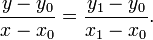
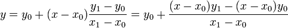
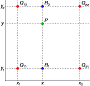
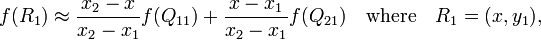
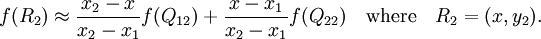
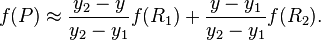
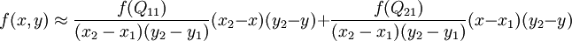

## 双线性插值

* [双线性插值(Bilinear Interpolation)](http://www.cnblogs.com/xpvincent/archive/2013/03/15/2961448.html)

### 1. 线性插值

已知坐标 (*x*0, *y*0) 与 (*x*1, *y*1)，要得到 [*x*0, *x*1] 区间内某一位置 *x* 在直线上的值

由于 *x* 值已知，所以可以从公式得到 y 的值

已知 *y* 求 *x* 的过程与以上过程相同，只是 *x* 与 *y* 要进行交换。

### 2. 双线性插值_线性插值_

* 在数学上，双线性插值是有两个变量的插值函数的线性插值扩展，其核心思想是在两个方向分别进行一次线性插值。

>  图中：红色的数据点与待插值得到的绿色点

* 假如我们想得到未知函数 *f* 在点 *P* = (*x*, *y*) 的值，假设我们已知函数 *f* 在 *Q*11 = (*x*1, *y*1)、*Q*12 = (*x*1, *y*2), *Q*21 = (*x*2, *y*1) 以及 *Q*22 = (*x*2, *y*2) 四个点的值。

1. 首先在 *x* 方向进行线性插值，得到

   

   

2. 然后在 *y* 方向进行线性插值，得到:

   

上面式子展开得到，所要的结果 *f*(*x*, *y*)